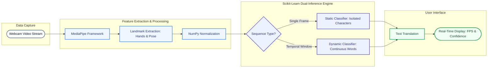

# 🤟 TransLingua: Real-Time Sign Language Translation Pipeline


**TransLingua** is a machine learning-powered computer vision system designed to bridge the communication gap by translating sign language gestures into text in real-time. It features a dual-classification engine capable of interpreting both static characters (alphabets) and dynamic sequences (words) with high confidence and processing speed.

---

## 📑 Table of Contents
1. [Summary](#-summary)
2. [Why this Project?](#-why-this-project)
3. [Design Pattern & Pipeline](#-design-pattern--pipeline)
4. [System Architecture](#-system-architecture)
5. [Key Features](#-key-features)
6. [Tech Stack](#-tech-stack)
7. [Installation & Setup](#-installation--setup)
8. [Project Architecture (Folder Structure)](#-project-architecture)

---

## 🎯 Summary
TransLingua leverages Google's MediaPipe for robust spatial landmark detection and Scikit-Learn for highly optimized inference. By capturing coordinate data directly from hand and pose landmarks, the system categorizes gestures via two distinct pipelines: one for static frames (individual letters) and another for sequential, multi-frame actions (words and phrases). 

## 💡 Why this Project?
For individuals who rely on sign language, daily interactions with non-signers can present significant friction. TransLingua aims to democratize communication accessibility. By using lightweight models and standard webcam inputs rather than expensive proprietary hardware, this project provides a scalable, open-source foundation for real-time gesture-to-text translation.

## ⚙️ Design Pattern & Pipeline
While not utilizing traditional LLM agents, TransLingua relies on a **Dual-Inference Pipeline Pattern** for computer vision:
* **Static Gesture Classifier:** Processes localized frame-by-frame spatial landmarks to output classifications for isolated characters.
* **Dynamic Sequence Classifier:** Processes a time-series window of landmarks to capture temporal dependencies, effectively translating continuous movements into complete words.
* **Performance Monitoring:** Built-in benchmarking dynamically tracks FPS, minimum/maximum inference times, and average prediction confidence for both static and dynamic pipelines.

## 🏗️ System Architecture


1.  **Input Layer:** Standard web camera captures video frames.
2.  **Feature Extraction Layer (MediaPipe):** Extracts specific X, Y, Z coordinates for hand and pose landmarks.
3.  **Preprocessing Layer (NumPy):** Normalizes landmarks and converts them into flattened `.npy` arrays.
4.  **Classification Layer (Scikit-Learn):** Routes array data to either the Static Model or Dynamic Model based on the detection mode.
5.  **Output Layer:** Renders the predicted text and confidence metrics back to the user interface.

## ✨ Key Features
* **Real-Time Processing:** Optimized for high FPS, executing inferences in milliseconds.
* **Comprehensive Data Handling:** Custom data collection logic supporting over 30,000 `.npy` files.
* **Static Translation:** Accurately classifies isolated manual alphabet characters.
* **Dynamic Translation:** Tracks temporal motion sequences to translate up to 10 distinct, continuous words.
* **System Profiling:** Real-time feedback on model performance, including average confidence percentages and inference speeds.

## 🛠️ Tech Stack
* **Programming Language:** Python
* **Computer Vision:** OpenCV, Google MediaPipe
* **Machine Learning:** Scikit-Learn
* **Data Processing:** NumPy, SciPy
* **Environment:** Jupyter Notebook

## 🚀 Installation & Setup

### Prerequisites
Ensure you have Python 3.8+ and `pip` installed on your machine.

### Step-by-Step Guide
1. **Clone the Repository:**
   ```bash
   git clone [https://github.com/dR-ViBE/TransLingua.git](https://github.com/dR-ViBE/TransLingua.git)
   cd TransLingua
2. **Create a Virtual Environment (Recommended):**
   ```bash
   python -m venv mp_env
   source mp_env/bin/activate  # On Windows use: mp_env\Scripts\activate
   
3. **Install Dependencies:**
   ```bash
   pip install -r requirements.txt
4. **Launch the Pipeline:**
   ```bash
   jupyter notebook ganeshpr_Project.ipynb
## 📂 Project Structure:
```text
TransLingua/
│
├── static_data/                 # Spatial data for isolated characters
│   ├── A/                       # ~300 .npy sample files per character
│   ├── B/
│   ├── C/
│   └── ...                      # (Remaining alphabet)
│
├── dynamic_data/                # Temporal sequence data for continuous words
│   ├── hello/                   # 15-40 sequence samples per word
│   ├── thank_you/
│   ├── please/
│   └── ...                      # (10 dynamic words total)
│
├── ganeshpr_Project.ipynb       # Main execution and inference pipeline
├── requirements.txt             # Project dependencies
└── README.md                    # Project documentation
```
## 📊 Data Collection & Dataset Engineering

A robust, custom-built dataset is the core of TransLingua's high accuracy. To ensure data integrity and optimal training performance, the project utilizes a rigorous automated data collection script to capture, process, and store nearly **30,000 localized landmark arrays**.

### 1. Spatial Feature Extraction
Instead of storing heavy, raw image files (which introduce noise and lighting bias), the pipeline captures specific **Hand and Pose landmarks** via a standard webcam feed using MediaPipe. These spatial coordinates are instantly extracted, normalized, and flattened into lightweight 1D NumPy arrays (`.npy`), ensuring rapid I/O operations and highly efficient model training.

### 2. Static Data Pipeline (Isolated Characters)
For static manual gestures (e.g., individual letters of the alphabet):
* **Structure:** Segregated into individual subfolders for each distinct character.
* **Volume:** Approximately **300 unique `.npy` samples** collected per character.
* **Capture Method:** Single-frame spatial coordinate extraction designed to capture the exact finger configuration and hand positioning at a specific fraction of a second.

### 3. Dynamic Data Pipeline (Continuous Words)
For dynamic, multi-motion gestures (e.g., full words or phrases):
* **Structure:** 10 dedicated subfolders, representing 10 distinct vocabulary words.
* **Volume:** **15 to 40 complete sequence samples** per word.
* **Capture Method:** Temporal windowing. Because meaning is derived from motion, each sample captures a continuous sequence of frames over a set timeframe to track the exact spatial trajectory of the gesture.

### 4. Data Quality Assurance & Preprocessing
To ensure high-fidelity model training and prevent overfitting:
* **Relative Normalization:** All spatial coordinates are normalized, ensuring the models remain invariant to the user's distance from the camera or varying body proportions.
* **Consistency:** The automated collection script verifies the matrix shape and integrity of every `.npy` file, guaranteeing uniform data dimensions before the arrays are fed into the Scikit-Learn training pipelines.
